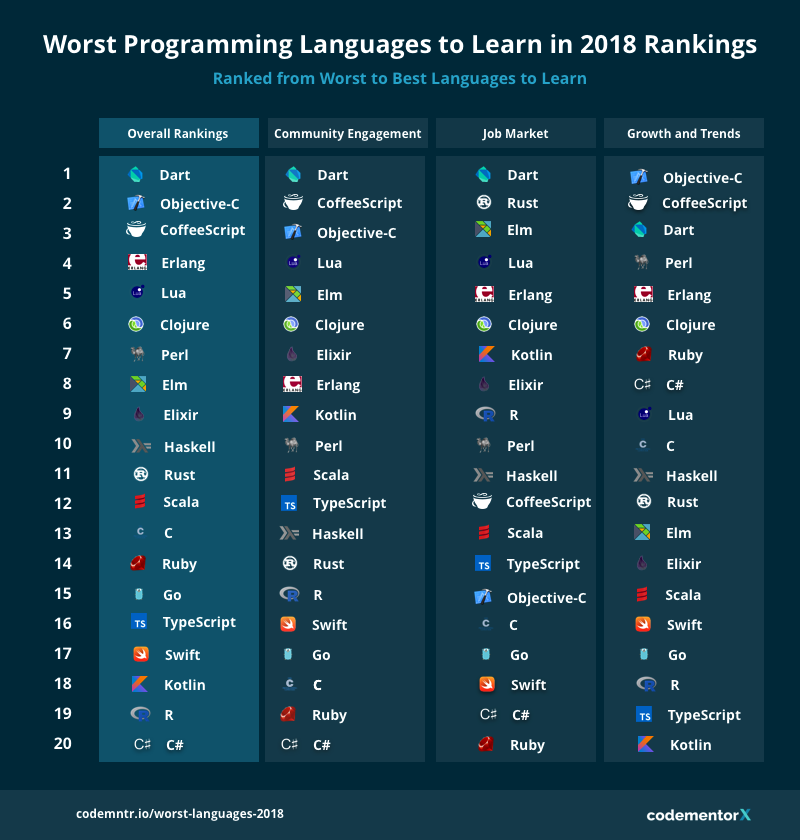

In October 2011, rumor became reality when Google released a new language aimed at
developing complex, Google-scale web applications. An internal Google email titled
“Future of JavaScript” had appeared on the web a month earlier, indicating that a language, possibly to be known as Dash, was undergoing development within Google, with
the aim of being a better language for the web than JavaScript. Born out of frustration
with the slow progress in evolving JavaScript, partly caused by the numerous interested
parties and committees, this new language aimed to be everything JavaScript could be
if it were invented now. Its key goal was to “maintain the dynamic nature of JavaScript,
but have a better performance profile and be amenable to tooling for large projects.”
It would also be able to cross-compile to JavaScript. This language was released as a technical preview to the wider world and given the name Dart

https://www.infoq.cn/article/acRVVkbDzeUTS*DD6wv5

https://medium.com/hackernoon/10-good-reasons-why-you-should-learn-dart-4b257708a332

https://www.jianshu.com/p/c939a613dc4f

# 前言

# Dart 的「 前世今生 . 衰落与崛起 」

## Dart 语言的诞生

> 2011 年 9 月,网络上出现了一封标题为"Future of JavaScript"的谷歌内部电子邮件,邮件中表明,由于 Javascript 语言发展缓慢,谷歌内部正在开发一门比 JavaScript 更好的 web 语言。这门新语言的目标是实现 JavaScript 所能实现的一切。它的主要目标是"保持 JavaScript 的动态特性,但要有更好的性能配置文件,并能适应大型项目的工具"。它还可以交叉编译成 JavaScript。这种语言作为技术预览版向更广泛的世界发布,并命名为 Dart。 - 引自 《Dart in Action》

> 2011 年 10 月 10 日的 GOTO 大会上,谷歌的两位工程师 Lars Bak (V8 JavaScript engine 项目组长..)和 Gilad Bracha (实现定制 Java/JVM 规范,JVM 规范主要贡献者..) 发布了"Dart",也验证了之前 email 传闻。Dart 是一种全新的编程语言,旨在帮助开发者构建 Web 应用程序。

对 Dart 语言开发团队有兴趣的话~可戳 👉[Dart 语言背后有哪些大牛？](https://www.infoq.cn/article/2015/04/dart-1.8-javascript)

## Dart 1.0 《Dart 1.0: A stable SDK for structured web apps》

2013 年 11 月 14 日,谷歌发布 Dart 1.0 版。Dart 1.0 版本发布,不但推出了 Dart 语言 1.0 版本而且还推出了相关开源工具箱和配套的编辑器。为了推广 Dart,Google 在 Chrome 内置了 DartVM 引擎(已在 2015 年移除),彼时 JavaScript 却因为 NodeJs 生态的崛起而焕发了第二春,而 Dart 却不温不火,且因为其运行效率饱受诟病。

就这样,Dart 还在 2018 年 "荣获 20 大糟糕语言榜首",总结 「 Javascript 很"忙",Dart 很"惨" 」。

## Dart 2.0 《Announcing Dart 2 Stable and the Dart Web Platform》

2018 年 8 月 8 日,谷歌发布 Dart2.0 版本。谷歌对 Dart 进行全新改版,从底层重构了 Dart 语言,加入了很多面向未来的新特性,语言性能大幅提供。Dart 开发团队总结了 Dart1.0 版本的优缺点,决定打造一个运行更快、更加安全的强类型语言 Dart2.0（在 Dart2.0 之前,Dart 是一门弱类型语言。此次发布谷歌不仅发布了 Dart 2.0 稳定版,而且还重写了 Dart web platform。新版的 web platform 提供了一套高性能、可扩展的生产力工具。

## Flutter 发布 《Flutter 1.0: Google’s Portable UI Toolkit》

Google 内部用 Dart 编写孵化了一个移动开发框架 Sky,之后又被命名为 Flutter,进入了移动跨平台开发的领域。

2018 年 12 月 4 日,谷歌发布 Flutter 1.0 版本。

Flutter 是谷歌开源的移动应用开发 SDK,使用 Flutter 可以直接开发 Android 和 iOS 应用。其最大的特点就是一套代码多平台运行、高性能和 Hot Reload（热重载）。谷歌即将发布 Fuchsia 系统就以 Flutter 为主要开发框架。Flutter 采用 Dart 作为其底层语言。Dart 也由于 Flutter 美好未来而得到众多开发者的青睐。

## Fuchsia 技术选型,Dart 笑到最后

Android 和 Chrome OS 可能是谷歌最知名的 OS 项目,但实际上这两年曝光量逐渐增大的是谷歌正在开发的第三个操作系统——Fuchsia。Fuchsia 是一个开源项目,类似于 AOSP（Android 开放源代码项目）,但 Fuchsia 可以运行各种设备,从智能家居设备到笔记本电脑和手机等等。它也被认为是建立在一个谷歌构建的名为“zircon”的全新内核之上,而不是构成 Android 和 Chrome 操作系统基础的 Linux 内核。

近日谷歌 Fuchsia 网站上更新了一则[“Fuchsia Programming Language Policy”](https://fuchsia.googlesource.com/fuchsia/+/refs/heads/master/docs/project/policy/programming_languages.md)的文档,详细解释了 Fuchsia 项目在编程语言方面的选型考虑。据官方文档披露,C/C++、Dart、Rust、Go 语言都是 Fuchsia 开发的候选语言,除了老牌编程语言 C 和 C++ 的江湖地位稳固得到了官方开发人员的认可以外,新兴编程语言中,Dart 击败了 Rust 和 Go 语言,成为用户 UI 界面的正式官方语言。
